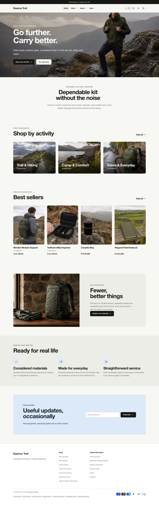
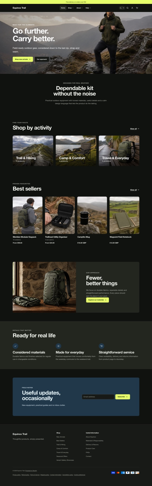
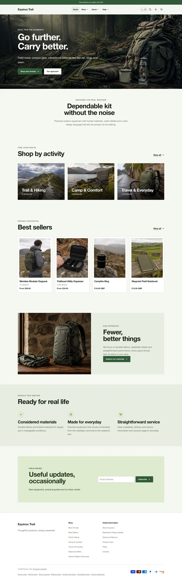
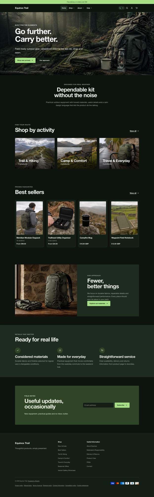
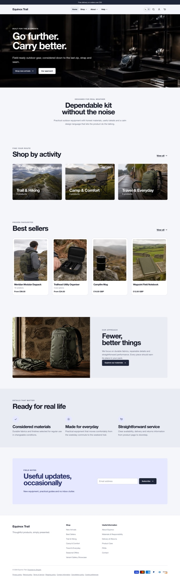
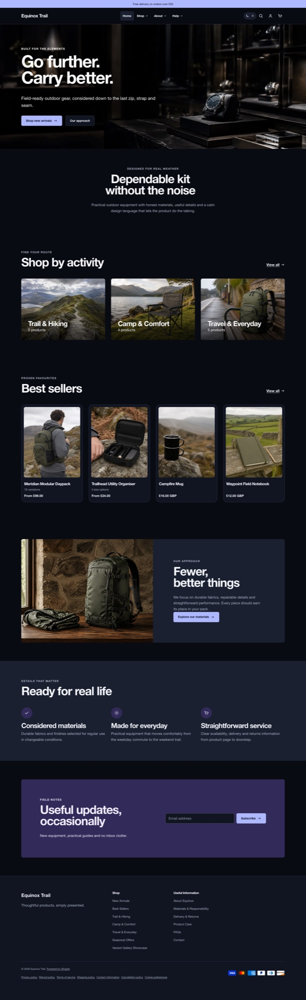
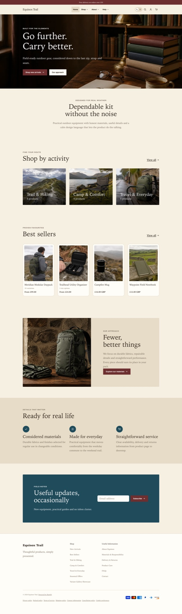
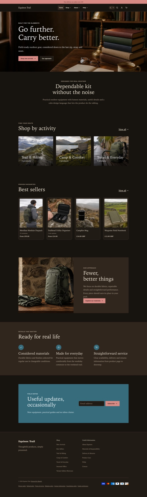
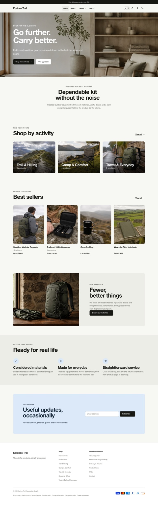
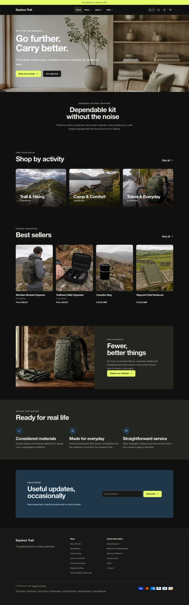

# Presets

A preset is a complete design system: the **light and dark colour palettes**,
the four **font roles** and full **type scale**, **spacing**, **card and button
shape**, the **lifestyle fallback image style**, and a **matching demo
homepage**. Switching preset changes all of these at once; it does not change
your content, menus, logo, or catalog.

## The five presets

### Equinox Trail

| Light | Dark |
|---|---|
|  |  |

The signature look. Warm greige neutrals with near-black ink in light mode; an
electric-lime accent on charcoal in dark mode. System sans-serif with tightly
tracked display headings, soft 12&nbsp;px cards, minimal card style, and a
branded editorial hero image. A safe, contemporary default for most brands.

### Forest

| Light | Dark |
|---|---|
|  |  |

Grounded and outdoors. Deep pine-green primary on a soft warm-white background,
outlined cards with a crisp 4&nbsp;px radius, and slightly more space between
lines. Suits outdoor, garden, food, and sustainability brands.

### Midnight

| Light | Dark |
|---|---|
|  |  |

Editorial and premium, designed dark-mode-first. Ink-navy and cool grey,
oversized display type, a wider content measure and generous section spacing,
outlined cards at 8&nbsp;px. Suits technology, jewellery, spirits, and
high-consideration products.

### Bookshop

| Light | Dark |
|---|---|
|  |  |

Literary and warm. Full serif for both headings and body, cream paper tones,
burgundy and teal accents, tight 2–4&nbsp;px radii, and a relaxed reading
line-height. Suits stationery, publishing, coffee, homeware, and heritage
brands.

### Nordic

| Light | Dark |
|---|---|
|  |  |

The pared-back Scandinavian baseline. Bright white, minimal chrome, soft
rounded cards at 12&nbsp;px, and a clean lime accent. The lightest, quietest
preset — a strong starting point when you want the product photography to carry
the page.

## Switching preset

Use the theme library style / preset selector for Equinox. On changing preset,
Shopify replaces the values under **Theme settings** (colours, typography,
layout, cards, buttons). Any values you had customised are overwritten, so note
your brand colours first if you have already set them.

## Fine-tuning after choosing

Every preset is only a starting point. After selecting one you can still change
any individual setting — swap the accent colour, pick a different heading font,
widen the page, change the card style — from **Theme settings**.
